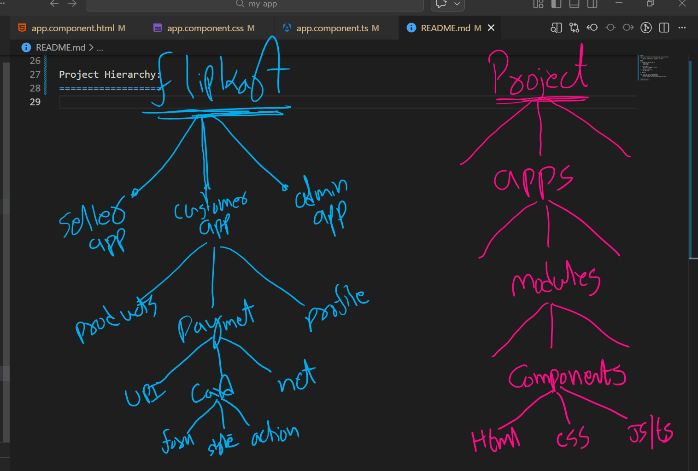

Angular:
--------
Angular is a framework to build single page applicaitons(SPA).

   Framework: combination of languages, libraries

Start:
------
1) download and install node js
      check: node-v
      check: npm -v

2) install angular
      npm install -g @angular/cli@15
      check: ng version

3) create new angular app
      ng new my-app

4) ng serve

***) First time allow scripts exection 
   1) open powersell has administrator
   2) run the command: set-executionPolicy unrestricted

Project Hierarchy:
==================

GIT:
----
1) laptop <-> website

      git config --global user.name  "Your Name"
      git config --global user.email "Your email"

      check: git config --list

2) folder <-> repository

      git init
      git remote add origin xxxxxxxxxxxxxxxxxx

      check: git remote -v

3) sync code

      git add .
      git commit -m "first commit"
      git push

      **) first time follow the suggestion command

      