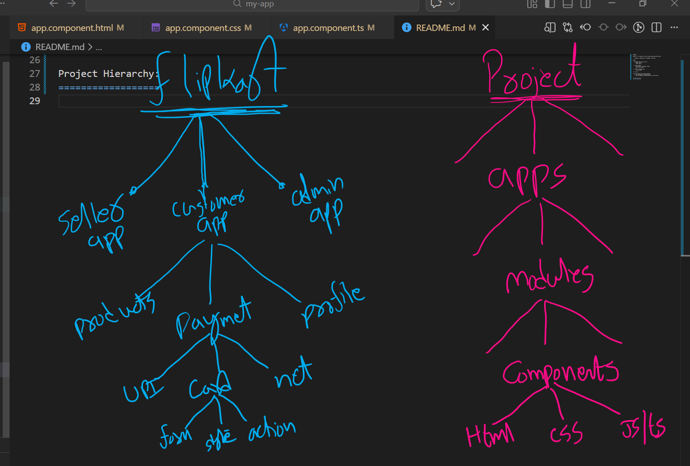

Angular:
--------
Angular is a framework to build single page applicaitons(SPA).

   Framework: combination of languages, libraries

Start:
------
1) download and install node js
      check: node-v
      check: npm -v

2) install angular
      npm install -g @angular/cli@15
      check: ng version

3) create new angular app
      ng new my-app

4) ng serve

***) First time allow scripts exection 
   1) open powersell has administrator
   2) run the command: set-executionPolicy unrestricted

Project Hierarchy:
==================

GIT:
----
1) laptop <-> website

      git config --global user.name  "Your Name"
      git config --global user.email "Your email"

      check: git config --list

2) folder <-> repository

      git init
      git remote add origin xxxxxxxxxxxxxxxxxx

      check: git remote -v

3) sync code

      git add .                        // check: changes->staged changes
      git commit -m "first commit"     // staged chages -> 0
      git push                         // upload percentage 100%, github commit list

      **) first time follow the suggestion command

Angular Architecture:
=====================

Directives:  useful to alter the DOM
==========

      1) structural directives: *ngFor, *ngIf

      2) attrivute direcgties: [ngClass]  [ngStyle]

      ng g c employees

API INTEGRATION:
================

Client server architecture:
----------------------------

Sync vs async code
------------------

RxJS: Reactive exptenstion for javascript
-----

          Promise                             Observable                                 
      --------------                        --------------                            
1)  single call back                        multi call back 

2)  can not cancel                          can cancel in between      

      Observable                               Subject
      ----------                            --------------
1)   unicasting                             multi casting

component vs service
--------------------
component:   view
service: logics oter than view

Data flow in frontend applications
----------------------------------

Coding steps:
-------------
0) create component and service

1) import HttpClientModule in appModule

2) inject HttpClient service in vehicle service

3) method to hit api with get method
   it return observabel of data

4) inject vehicle service in vehicle component
   subscribe to the observable to get the data

5) in html iterate over the array with *ngFor

ng g c create-user
------------------
name
age
email
phone

ng g c create-vehicle
---------------------
 {
    "Vehicle": "Mazda Model 3",
    "manufacturer": "Renault",
    "model": "Malibu",
    "type": "Extended Cab Pickup",
    "fuel": "Diesel",
    "color": "gold",
    "image": "https://picsum.photos/seed/BazcWx/108/1909",
    "cost": "408.09",
    "tyres": 89,
  },

Template Driven Forms: ng-model
----------------------

Reactive Forms:
---------------
1) FormGroup
2) NestedFormGroup
3) FormArray
4) Dynamic forms
5) Form Validations

TS:
---
name: new FormControl('', [Validators.required, Validators.minLength(3), Validators.maxLengt(10)]),

HTML:
-----

        
Name is required

        
Name shoudl contain min 3 chars

        
Name shoudl contain max 10 chars

      FromGroup:         userForm.get('name')

      NestedFormGroup:   userForm.get('address')?.get('city')

      FormArray:         cardsFormArray.controls[i]?.get('name')

      